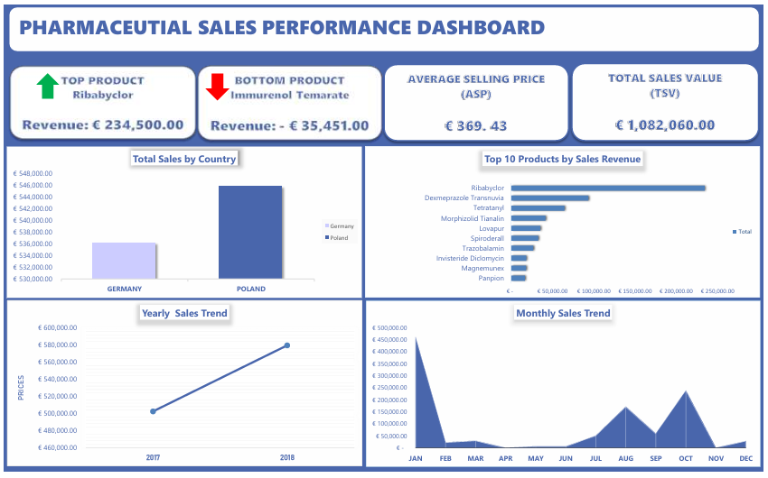
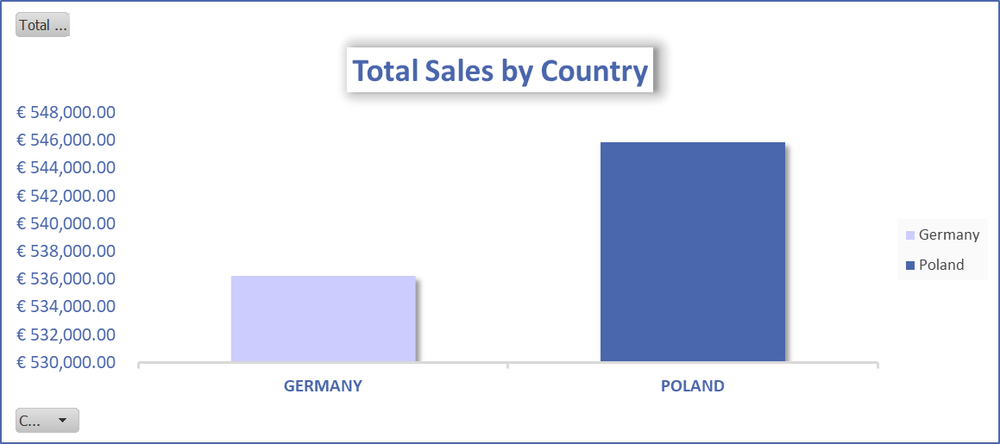
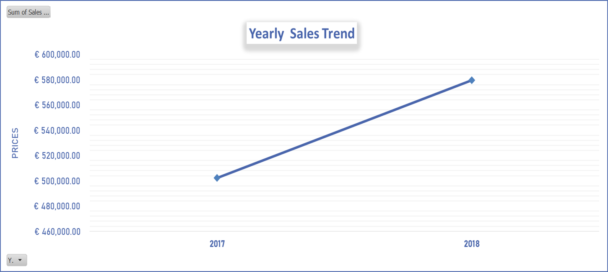
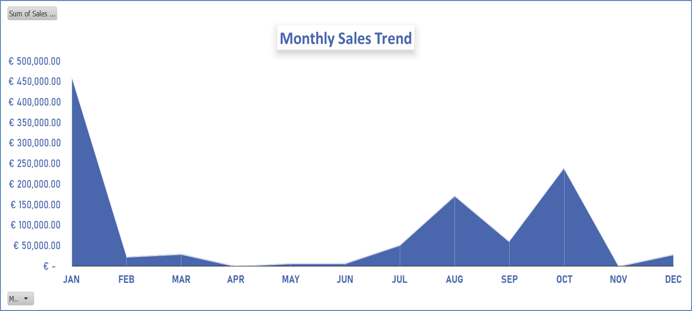
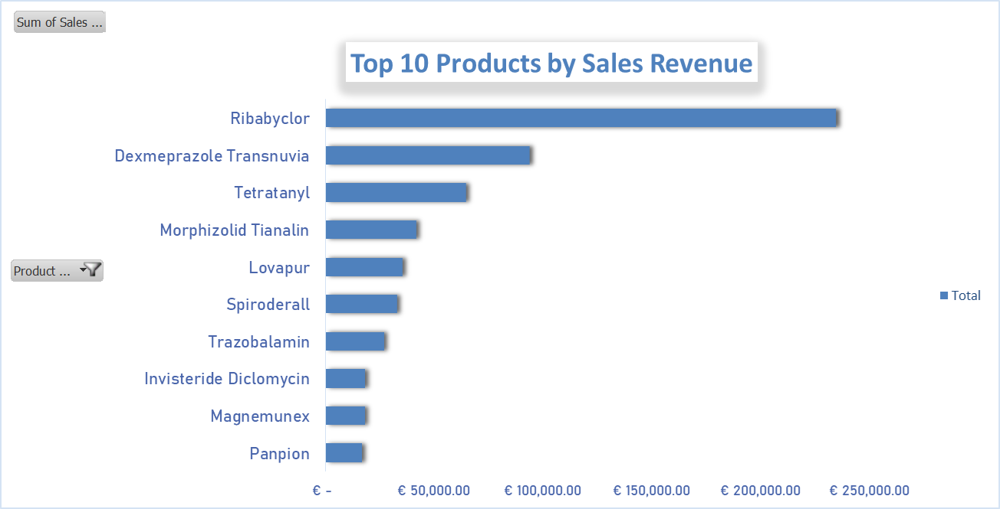

# 📊 Pharmaceutial Sales Analysis | Excel
This project presents a comprehensive analysis of pharmaceutical sales data across 2017 and 2018, aimed at uncovering key revenue drivers, product performance, and regional sales trends.

## 🔍Overview
The dataset contains detailed pharmaceutical sales records across distributors, customers, products, and regions.
The analysis was conducted entirely in Microsoft Excel using;
- Power query editor
- PivotTables
- And visualisations to transform raw transactional data into actionable business insights.

Five core business questions were addressed, each supported by dedicated PivotTables and charts. A consolidated dashboard was also developed to provide a high-level overview of all insights in a single view.

## 📊 Dashboard Preview
A consolidated view of all key analyses and insights.

  

## 🎯 Objectives
The analysis was guided by the following business questions:
- Analyse sales data to identify high-performing products and revenue drivers
- Evaluate country-level performance and regional contribution to revenue
- Examine sales trends over time (yearly and monthly)
- Identify top and bottom performing products
- Calculate total revenue and assess overall business performance
- Develop a dashboard for clear and interactive insight presentation

## ❓Business Questions
- Which products generate the highest total sales?
- Which country performs best in terms of sales?
- How does sales performance change over time?
- What are the top and bottom performing products?
- What is the total sales value across the dataset?

## 📚Dataset Description
- **Source:** Brain Pharmacy Dataset
- _Time Period: 2017 – 2018_
- _Data Type: Transactional Sales Data_
- **Key Fields/Columns:** Distributor, Customer Name, City, Country, Channel, Sub-channel, Product Name, Product Class, Quantity, Price, Sales Revenue, Month, Year, Sales Rep, Manager, Sales Team

## 🛠Tools & Technologies Used
- Microsoft Excel
   - Power Query (Data Cleaning & Transformation)
   - PivotTables
   - Charts (Bar, Line, KPI visuals)

## 🧹Data Cleaning and Preperation (Power Query)
- Removed duplicate records
- Handled missing values
- Corrected data types (dates, currency, numeric fields)
- Standardised inconsistent text formats
- Cleaned trailing spaces and formatting issues
- Verified Month and Year fields for time-based analysis
- Identified anomalies (negative sales values)
  
## 📈Key Trends Discovered
### 1. Product Revenue Concentration
Sales are heavily concentrated in a single product. Ribabyclor alone contributes **approximately 21.7% of total revenue,** significantly outperforming all other products.
This level of concentration introduces product dependency risk, where overall revenue performance becomes highly sensitive to the availability, pricing, or demand fluctuations of a single product.

### 2. Country Performance
Poland is the top-performing country with €545,868, slightly ahead of Germany (€536,192).
Revenue distribution is nearly equal across both countries, indicating a balanced market presence but limited regional differentiation or dominance.

### 3. Sales Trend Over Time
Total sales increased from €502,404 in 2017 to €579,656 in 2018 (+15.4% growth).

Despite overall growth, monthly performance is uneven.

- Peak month : **January and October**
- Low month : **April and November**
This indicates **seasonality or inconsistent demand cycles,** rather than stable growth throughout the year.

### 4. Product Performance Gap
There is a significant disparity between top and bottom-performing products. To clearly communicate both extremes, the analysis separates high-performing products (visualised in the Top 10 chart) from the lowest-performing product (highlighted via KPI cards in the dashboard):

Top: **Ribabyclor (€234,500)**

Bottom: **Immurenol Temarate (-€35,451)**

Negative sales values suggest returns, pricing issues, or operational inefficiencies, and highlight potential weaknesses in product lifecycle management.

### 5. Total Revenue Performance
Total sales across the dataset amount to **€1,082,060.**
This represents the overall business performance across both countries over the two-year period and provides a benchmark for future growth analysis.

## 📈 Trends and Behavioural Patterns
Sales performance shows a clear growth trajectory, but the pattern is structurally inconsistent.

While overall revenue increased year-on-year, the concentration of sales in specific months suggests that performance is driven by periodic spikes rather than sustained demand. This could be influenced by: 
- Promotional campaigns
- Bulk distributor purchases
- Seasonal demand cycles

The strong dominance of Ribabyclor indicates that product-market fit is not evenly distributed across the portfolio. Most products contribute marginally, suggesting:
- Weak positioning
- Low demand
- Or inadequate distribution strategies

From a regional perspective, the near-equal performance of Poland and Germany indicates stable market penetration, but also reveals a lack of aggressive expansion or differentiation strategy in either market.

## 📊 Dashboard Development (Project Requirements)
To address the business questions, five structured analyses were developed using PivotTables and visualisations:

- Product Sales Analysis – Identified top revenue-generating products
- Country Performance – Compared sales across regions
- Sales Trend (Yearly & Monthly) – Evaluated performance over time
- Top & Bottom Products – Highlighted best and worst performers
- Sales Summary (KPI) – Presented total revenue
  
Each analysis was built on a dedicated worksheet and supported with appropriate chart visualisations. The dashboard preview above provides a consolidated view of these analyses.

## ⭐ Exploratory Analysis (Beyond Project Requirements)

In addition to the core project requirements, an analysis of **Average Selling Price (ASP)** was conducted to better understand the relationship between pricing, sales volume, and revenue performance.

ASP was calculated as total sales revenue divided by total quantity sold, and is presented as a KPI in the dashboard.

The analysis reveals a clear distinction between **volume-driven** and **price-driven** revenue patterns within the dataset. Some products generate high revenue through large sales volumes at relatively lower prices, while others are sold in much smaller quantities but at significantly higher prices.

For example, several transactions involve very high quantities (e.g. 100–500 units) at moderate price levels, indicating bulk sales or high-demand products. In contrast, other transactions reflect low quantities (1–5 units) with high unit prices (above €700), suggesting premium or specialised products with limited demand.

Additionally, the presence of negative quantities in the dataset highlights product returns or adjustments, further reinforcing the need to interpret revenue performance alongside both pricing and volume dynamics.

This analysis provides a deeper understanding of how revenue is generated, showing that **high revenue is not solely driven by price, but by a combination of pricing strategy and sales volume.**

## 💡Recommendations
### **Reduce Product Dependency Risk**
  
Ribabyclor drives a disproportionate share of revenue. The business should:
- Strengthen supply chain reliability for this product
- Simultaneously invest in diversifying revenue across other products
  
### **Investigate Negative Revenue Products**
Immediate investigation is required for:
- Immurenol Temarate
- Raparidol

 _Focus areas:_
  - Return rates
  - Pricing errors
  - Distributor issues
  - Data entry accuracy
  
### **Optimise Low-Performing Products**
  
Products with consistently low or negative performance should be:
- Repositioned
- Bundled with high-performing products
- Or potentially discontinued

### **Address Seasonal Sales Volatility**
  
Low-performing months (April, November) require targeted intervention:
  - Promotional campaigns
  - Distributor incentives
  - Demand stimulation strategies

### **Strengthen Market Expansion Strategy**
  
With Poland and Germany performing almost equally, growth will require:
- Deeper penetration in high-performing regions
- Exploration of new markets
- Or differentiated strategies per country

## Conclusion
This project demonstrates the ability to clean, analyse, and interpret structured sales data using Excel. Beyond answering key business questions, the analysis highlights deeper patterns in product dependency, seasonal performance, and revenue distribution.

These insights provide a foundation for improving product strategy, stabilising revenue, and supporting data-driven decision-making.

## 📒Project Notebook 
- [**View Excel Project File (.xlsx)**](https://github.com/Adaeze-Jennifer/Pharmaceutical_Sales_Analysis/blob/main/project%20files/pharmaceutical_sales_analysis.xlsx)–  Contains the complete Excel workbook, including data cleaning (Power Query), structured analysis (PivotTables), and a fully developed interactive dashboard.
- [**Dashboard Preview**](https://github.com/Adaeze-Jennifer/Pharmaceutical_Sales_Analysis/blob/main/images/dashboard_screenshot.png) – Snapshot of the final dashboard highlighting key insights and performance metrics.
- [**View Full Repository**](https://github.com/Adaeze-Jennifer/Pharmaceutical_Sales_Analysis) – Access the full project, including documentation, images, and analysis breakdown.
- [_Back to Top_](#Pharmaceutical_Sales_Analysis) - Project Overview and Documentation.
